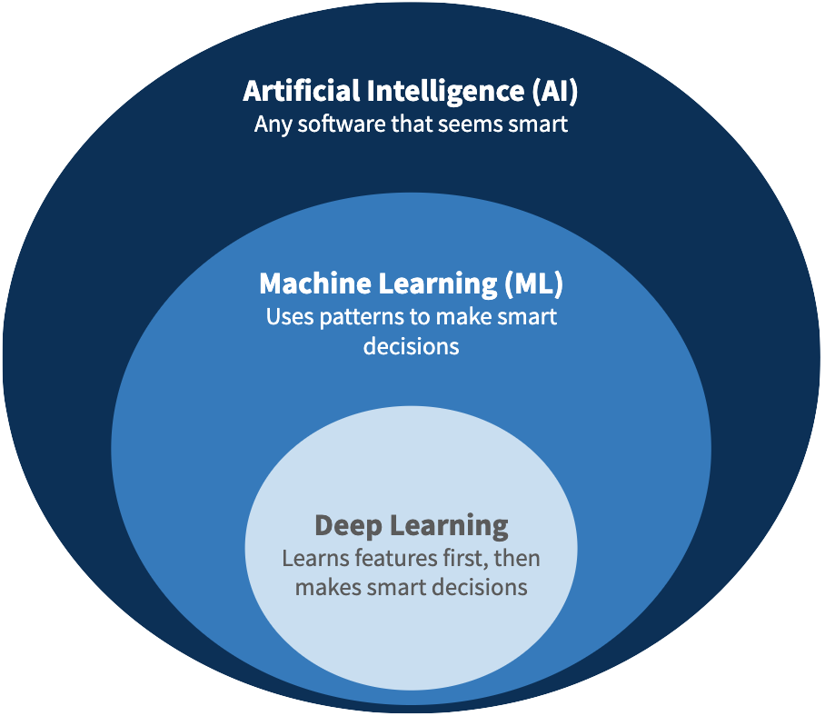
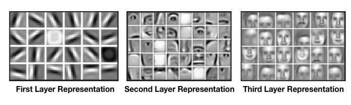
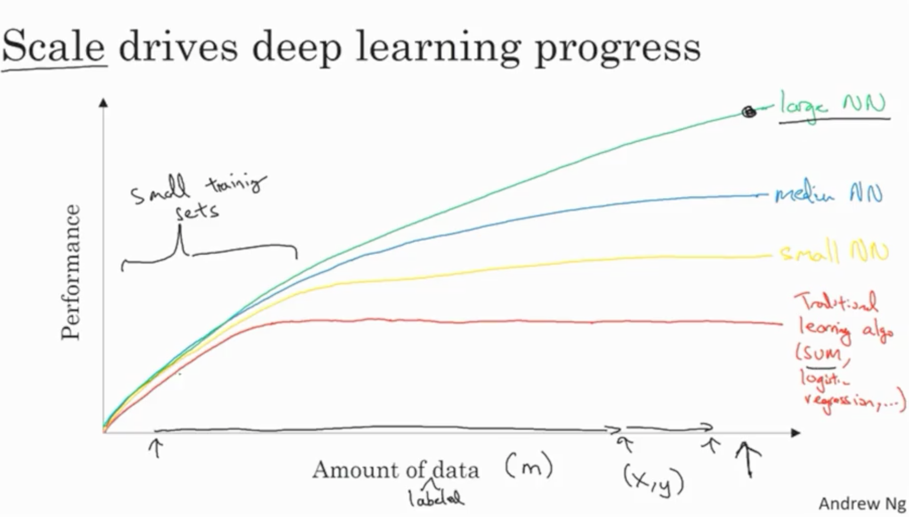

Artificial Intelligence (AI) and Machine Learning (ML) are often conflated, but they are not the same. Rather, ML is a subset of AI. Deep Learning (DL) is a subset of ML.

**AI** is “intelligence demonstrated by machines...that mimic cognitive functions that humans associate with the human mind, such as learning and problem solving”.[^1]
Informally:

> AI systems **seem smart**.[^2]

[^1]: from the [Wikipedia definition for AI](https://en.wikipedia.org/wiki/Artificial_intelligence)
[^2]: The famous [Turing Test](https://en.wikipedia.org/wiki/Turing_test) posits that “seeming smart” is the same as “being smart”

If you think this is a mushy, ambiguous definition, you would be correct.
If you are looking for a more rigorous definition, be prepared to fail.
There isn’t one.

The [fathers of AI](<https://en.wikipedia.org/wiki/John_McCarthy_(computer_scientist)#Contributions_in_computer_science>), John McCarthy and Marvin Minksy, coined the term AI in 1955 to mean "making a machine behave in ways that would be called intelligent if a human were so behaving".[^3]

[^3]: from [A Proposal for the Dartmouth Summer Research Project on Artificial Intelligence](http://www-formal.stanford.edu/jmc/history/dartmouth/dartmouth.html)

In 2005, Minsky coined the phrase ["suitcase word"](https://alexvermeer.com/unpacking-suitcase-words/) to describe how people cram terms like "consciousness" and "intelligence" with different meanings.[^4]
[^4]: from [The Emotion Machine](https://web.media.mit.edu/~minsky/eb4.html)

Are virtual assistants like Siri and Alexa "smart"?
How about automated phone systems?
Or calculators?
Reasonable people will disagree.

**ML**, on the other hand, is the ability “to perform a specific task without using explicit instructions, relying on patterns and inference instead”.[^5]
Informally:

> ML systems **seem smart** by using **patterns** in data.

[^5]: from the [Wikipedia definition for ML](https://en.wikipedia.org/wiki/Machine_learning)

Unlike AI, ML can be defined much more rigorously, even mathematically. For example, in ML we can often define an **accuracy metric** to formalize what we mean by “smart”. I won’t go into the math here, but I will take some time to discuss the most common types of ML.

## Types of ML

The three main types of ML in research and in practice are [Supervised Learning, Unsupervised learning, and Reinforcement Learning](https://en.wikipedia.org/wiki/Machine_learning#Types_of_learning_algorithms).

### Supervised Learning

> ...seems smart by making smart **predictions**

> ...gets smarter by **learning from observations**

Most successful ML done in industry is Supervised Learning.
It is the most well-understood type of ML.
Because more observations can be fed into the system, the model can get **smarter over time**.
These “observations” are examples shown to the system by a human.[^6]
The human acts as the “supervisor”, giving the machine the correct example of how to behave.
[^6]: ...or other label source e.g. ground truth

**Example**: Google Photos tags people in photos and asks you if the person in two different pictures is the same person or not.

### Unsupervised Learning

> ...seems smart by finding **structure** in data

> ...cannot get smarter without **manual tuning**

“Unsupervised Learning” is a misnomer in that no learning is taking place.
These systems **do not learn** from observations nor experience, so changing the code or tuning parameters manually are the main ways to make Unsupervised Learning systems smarter.
Simple clustering algorithms fit in this bucket.
Anything beyond simple clustering is still being researched but not used widely in industry.

**Example**: Netflix groups similar movies into custom genres.

### Reinforcement Learning

> ...seems smart by taking smart **actions**

> ...gets smarter by **learning from experience**

In Reinforcement Learning, the model is called an “agent” that can **take actions** in its **environment**.
Notably, agents do so by thinking about how well they are doing so far and what consequences their next action will bring.
Unlike Supervised Learning systems that can only observe passively, Reinforcement Learning agents can _explore_ their environment and try things out.
In a sense, RL agents _supervise themselves_.
They seek the correct behavior without seeing it first.
Reinforcement learning is still studied in cutting-edge research and is not widely used in industry.

**Example**: [AlphaZero](https://deepmind.com/blog/article/alphazero-shedding-new-light-grand-games-chess-shogi-and-go) learns to play superhuman chess by playing against itself.

## A note on Deep Learning

You’ve probably heard of “Deep Learning”. Right now, Deep Learning is popular because of its record-breaking smartness on known ML benchmarks, such as image classification (e.g. “Is there a cat in this photo?”).

Philosophically, Deep Learning is about **learning features** of the data first and then using those features to learn how to do well on the original task.

In practice, most Deep Learning is done by using larger Neural Networks (**Supervised** ML that has been around for decades) than was previously feasible.
The parts of the network closest to the data implicitly learn how to **extract features**—detecting straight lines or boundaries from raw pixels—and the further parts of the network can then use those features—detecting faces from lines and boundaries.
In theory, ML models other than Neural Nets could also be used to learn features.
So in the future, you may see Deep Learning without Neural Networks, but don’t hold your breath.

The Deep Learning craze is happening now due to recent advances in computation (e.g. faster processors and GPUs) that make this layered learning feasible.

Deep Learning comes with some tradeoffs:

- Good for unstructured data, such as images and text5
- More complex model that is hard to explain/interpret
- Achieving record-breaking results requires TONS of training data (e.g. tens of millions of labeled examples)[^7]
- ...

Figure above is taken from the [Deep Learning Specialization](https://www.coursera.org/specializations/deep-learning) on Coursera, taught by [Andrew Ng](https://en.wikipedia.org/wiki/Andrew_Ng).
For 'small' training sets (i.e. < 1M points), Neural Nets do not provide much benefit.
But, NNs are able to scale their learning for larger training sets, unlike traditional ML.

[^7]: [One-shot](https://en.wikipedia.org/wiki/One-shot_learning) Deep Learning only needs a handful of examples but is currently an active area of research
